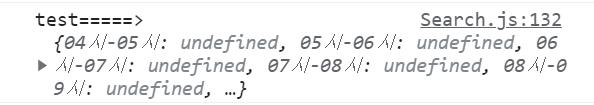

# React API에서 원하는 데이터만 선별해서 불러오기

- Saveme-helltro에서 어떻게 만들어야하는지 고민했던 부분입니다.
- 승차/하차 데이터가 같이 있는 api에서 따로 불러와 chart.js에 연결해야 했습니다.
- 링크
  https://github.com/noMoreTutankhamun/saveme-helltro/blob/main/frontend/src/components/Search.js
  <br />

```javascript
function isRIDE(obj) {
  //1. hasOwnProperty()메서드를 통해 원하는 정보가 담긴 api가 연결 됐는지 확인
  //+ 원하는 api 연결 안되었으면 실패 표시
  // hasOwnProperty() 메소드는 객체가 특정 프로퍼티를 가지고 있는지를 나타내는 불리언 값을 반환한다.
  let result = {};
  if (obj.hasOwnProperty("EIGHT_RIDE_NUM") === true) {
    //2. Object.keys 를 통해 프로퍼티 객체의 키를 배열로 리턴한다
    //Object.keys() 메소드는 주어진 객체의 속성 이름들을 일반적인 반복문과 동일한 순서로
    //순회되는 열거할 수 있는 배열로 반환합니다.
    const apiData = Object.keys(obj);
    //3. indexOf로 리턴한 apiData 배열 중에 '_RIDE'를 가진 배열만 리턴
    let ridekeys = apiData.filter((x) => {
      return x.indexOf("_RIDE") > -1;
    });
    // 4.obj의 값과 연결
    for (const txt of ridekeys) {
      //txt는 rideKeys의 string 값(key값)
      result[txt] = obj[txt];
    }
    return result;
  } else {
    console.log("API 연결 실패");
  }
}
```

## 주의 사항 - JavaScript Object &#91;‘key’&#93;(대괄호) vs Object.key(온점) 차이

- 식별자로 사용할 수 없는 단어를 객체의 키로 입력할 경우 문자열로 넣어줘야합니다. 문자열로 넣어준 키는 [] 대괄호로 부를 수 있습니다.
- 대신 온점은 vscode 등의 보조기능(자동완성같은)을 사용할 수 있어 더 많이 활용합니다.
- []는 property를 변수로 접근이 가능하고 .는 변수가 아닌 실제 속성에 접근해서 undefined로 출력됩니다.
- for문 같은 loop에서 사용할 때 result[txt] = obj[txt];로 사용해야합니다. result.txt=obj.txt;로 사용하면 아래이미지와 같은 undefined에러가 납니다.<br />
  

<br />
참조
https://medium.com/sjk5766/javascript-object-key-vs-object-key-%EC%B0%A8%EC%9D%B4-3c21eb49b763
